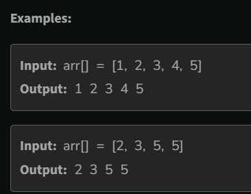

### 1.Ishaan Loves Chocolates:
```java
class Solution {
    public static int chocolates(int n, int[] arr) {
        int left=0,right=n-1;
        while(left<right)
        {
            if(arr[left]>=arr[right])
            {
                left++;
            }
            else
            {
                right--;
            }
        }
        return arr[left];
        // code here
    }
}
```
### Another approach for the same sum:
```java
class Solution {
    public static int chocolates(int n, int[] arr) {
        
        int min=arr[0];
        for(int i=0;i<n;i++)
        {
            if(arr[i]<min)
            {
                min=arr[i];
            }
        }
        return min;
    }
}
```
### 2.Move All Zeroes to End:
```java
class Solution {
    void pushZerosToEnd(int[] arr) {
        int l=0,r=0,n=arr.length;
        while(r<n)
        {
            if(arr[r]!=0)
            {
                int temp=arr[l];
                arr[l]=arr[r];
                arr[r]=temp;
                l++;
            }
            r++;
        }
    }
}
```

### 3.Sum of Natural Numbers:
```java
class Solution {
    public static int seriesSum(int n) {
        int sum=0;
         for(int i=0;i<=n;i++)
        {
            sum=sum+i;
        }
        return sum;
    }
}
```

### 4.Value equals to index value:
```java
class Solution {
    public List<Integer> valueEqualToIndex(List<Integer> nums) {
        List<Integer> result =new ArrayList<>();
        for(int i=0;i<nums.size();i++)
        {
            if(nums.get(i)==i+1)
            {
              result.add(i+1);  
            }
        }
        return result;
    }
}
```

### 5.Alternates in an Array:
```java
class Solution {
    public ArrayList<Integer> getAlternates(int arr[]) {
       ArrayList<Integer> result = new ArrayList<>();
       for(int i=0;i<arr.length;i++)
       {
         if(i%2==0)
         {
             result.add(arr[i]);
         }
       }
       return result;
    }
}
```

### 6.Palindromic Array
```java
class Solution {
    public static boolean isPalinArray(int[] arr) {
        for(int num:arr)
        {
            if(!isPalindrome(num))
            {
                return false;
            }
        }
        return true;
    }
    private static boolean isPalindrome(int num)
    {
        int original=num;
        int reverse =0;
        while(num>0)
        {
        int digit=num%10;
        reverse=reverse*10+digit;
        num=num/10;
        }
        return original==reverse;
    }
}
```

### 7.Count of Smaller elements:
```java
class Solution {
    public int countOfElements(int x, List<Integer> arr) {
        int count=0;
        for(int num:arr)
        {
           if(num<=x)
           {
               count++;
           }
        }
        return count;
    }
}
```

### 8.Sum of Array:
```java
class Solution {
    int arraySum(int arr[]) {
        int sum=0;
        for(int num:arr)
        {
            sum=sum+num;
        }
        return sum ;
    }
}
```

### Print Elemnts of Array;
```java
class Solution {

    void printArray(int arr[]) {
      for(int i=0;i<arr.length;i++)
      {
          System.out.print(" "+arr[i]);
      }
    }
}
```



